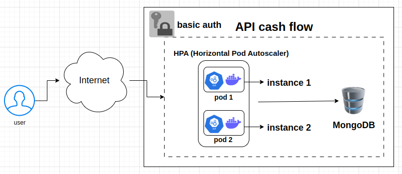

# API cash-flow
Merchant's Cash Flow

## Project's Architecture

### Goals
    - Control of financial entries and cash balance

### Instructions

Before install:

`Java (JDK 17): https://docs.oracle.com/en/java/javase/17/install/installation-jdk-microsoft-windows-platforms.html`

`Docker: https://docs.docker.com/`

`Kubernetes and Minikube (only deploy k8s cluster): https://kubernetes.io/docs/setup/`

Running local:

`git clone https://github.com/thiagohernandes/cash-flow.git`

`cd cash-flow`

`git checkout dev`

`mvn clean install`

`docker build -t api-cash-flow:1 .`

`docker-compose up -d`

### Swagger

`http://localhost:8088/swagger-ui/index.html`

### Calls

Postman: see postman's folder in project root (import and change IP Kubernetes's calls)

Return of entries and exits in the period and updated balance

`GET http://localhost:8088/cash-flow/daily-condensed/{initialDate}/{finalDate}`

`Example: http://localhost:8088/cash-flow/daily-condensed/2023-05-15/2023-05-17`

Important!

`
{
"initialDate": "2023-05-15",
"finalDate": "2023-05-15",
"input": 0, // total entries in the period
"output": 10, // total departures in the period
"balance": 60.0 // updated cash balance (actual balance and not what entered and left in the period)
}
`

Save an incoming (CREDIT) or outgoing (DEBIT) financial entry

`POST http://localhost:8088/cash-flow/save`

`Example: http://localhost:8088/cash-flow/save`

Return financial releases

`GET http://localhost:8088/cash-flow/financial-releases`

`Example: http://localhost:8088/cash-flow/financial-releases?initialDate=2023-05-15&finalDate=2023-05-17&type=DEBIT&page=0&sortType=DESC&size=10`

Important!

`
{
"type": "DEBIT",
"amount": 20, // total value of type searched (releases)
"releases": [
{
"id": "6467d8b6346af02a0b6bbc0d",
"date": "2023-05-15",
"type": "DEBIT",
"value": 10
},
{
"id": "646596812aee291cdc9497ef",
"date": "2023-05-16",
"type": "DEBIT",
"value": 10
}
],
"isLast": false, // if it is the last page (begin: 0, 1, ...)
"totalPages": 2 // total of pages. In this case, pages: 0 and 1
}
`

Body

`{
"date": "2023-05-15",
"type": "DEBIT",
"value": 30
}`

### Deploy Kubernetes (prod branch)

PS: before `mvn clean install`, if started docker compose, remove the MongoDB's container to avoid ports conflit

Do: `docker ps` and `docker rm -f <first letters container mongodb>`

Init Kubernetes Tool

`minikube start`

`minikube dashboard`

API Cash flow

`cd cash-flow`

`git checkout prod`

`cd k8s`

`kubectl apply -f .`

`kubectl get svc`

`minikube service api-cash-flow`

After last command, do:

`http://<ip-generated-local>:31000/swagger-ui/index.html`

`http://<ip-generated-local>:31000/cash-flow/daily-condensed/{initialDate}/{finalDate}`

`http://<ip-generated-local>:31000/cash-flow/save`

### Kubernetes Cluster

HPA (Horizontal Pod Autoscaling)

`The HPA was used with the execution of two instances aiming at performance and anticipating problems with availability and performance.`

